# agtop

A small, fast replacement for Claude Code's agents view (`claude agents`), written in Go.
It keeps the native layout and keys, and adds what the native view doesn't show.

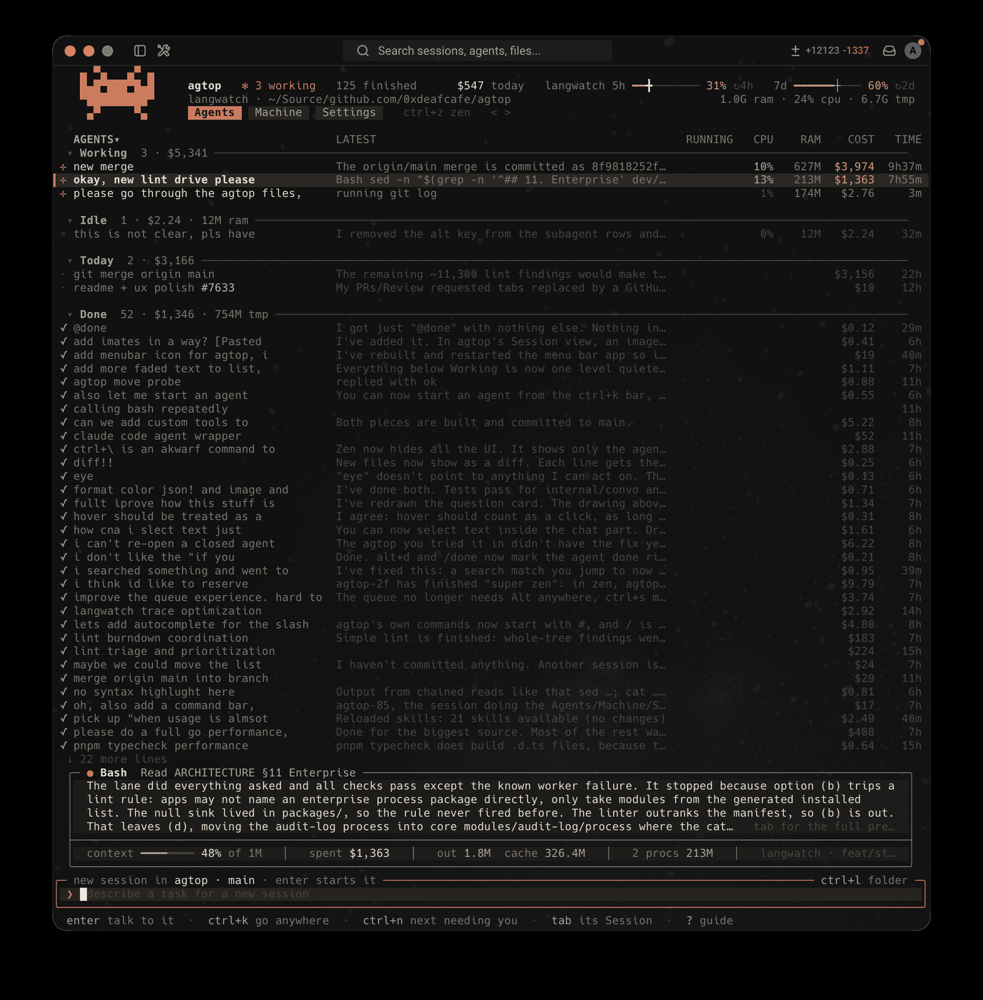

## Features

- **Every agent at a glance**: what each is doing, in words, with its cost, tokens, time, CPU and RAM.
- **Sessions you can read**: the conversation with highlighted code, commands in plain words, diffs, an overview, the files changed, the queue and the subagents at work.
- **Go anywhere** with `ctrl+k`: places, agents, turns, and a search through every agent's transcript.
- **Accounts that switch themselves**: every sign-in's 5-hour and weekly usage, and a switch to the one with the most room before a limit stops you.
- **The machine, tidied**: every agent's process tree, orphaned processes ended, worktrees and temp work cleaned up safely.
- **A menu bar icon** that shows usage and who needs you, and answers questions from their notifications.
- **agtop's own commands** with `#`, **Zen** for only what needs you, a colour-blind palette, and a tour to start with.
- **Light**: about 40 MB with a session open, against the native view's 330 MB.

## Install

```sh
go install github.com/0xdeafcafe/agtop/cmd/agtop@latest
agtop            # open it
agtop on         # make `claude agents` open it (adds one line to ~/.zshrc)
agtop off        # give `claude agents` back to Claude Code, instantly
agtop menubar    # put agtop in the macOS menu bar (agtop menubar off takes it out)
```

The first time it opens, a short tour points out each part of the screen; `#tour` shows it again. `?` is a guide to the keys.

## In detail

### Agents

- **Cost, tokens and time** for every agent, estimated from its transcript at list prices (subagents included), and today's spend per account.
- **What it's doing, in words**: "running pnpm test", "reading view.go", "searching for PrettyModel". Working agents stand out; idle, stopped and done ones step back. On a narrow screen rows take two lines and the header keeps to what fits.
- **CPU and RAM for everything an agent started**, not just the agent itself.
- **Preview** (`tab` or `→`): the agent's own screen, live, for background sessions the daemon hosts; otherwise what it is doing now, its last message, spend, and its process tree. Type into the prompt to reply without opening it.
- **Instant open** (`enter`): connects to the running session through the daemon the way the native view does. `←` inside the session, or `ctrl+]`, comes back.
- **Done** (`alt+d`) moves an agent out of the way, and stops its process if it's idle so finished work doesn't hold memory (a message resumes it). Nothing is merged or deleted.
- **Kill** (`ctrl+x`, or `ctrl+p` then `!`): stop gracefully, or SIGKILL the whole process tree.
- **Change repo** (`ctrl+l`): move a conversation to another folder or worktree, or grant it access to another folder.
- **Groups** (`ctrl+s`): group by status, repository, account, or your own groups (`ctrl+e`). Pins (`ctrl+t`) are shared with the native view.
- Notifications when an agent starts waiting on you, and optional hibernation (`#hibernate 30`) to stop finished agents still held in memory.

### Sessions

An agent run in agtop mode (Claude Code headless, hosted by agtop) opens in a Session beside the list, with five views (`[` `]`):

- **Conversation**: narration, steps and the answer on one axis. Clean steps fold to one row naming what they were; a failure shows the line that says what went wrong. Shell commands say what they do (a `sed -n` is a read of its file, a `grep` a search, a heredoc a write), and code is highlighted: the answer's code blocks, files read, search hits, diffs with the changed words picked out, and JSON a tool printed. Drag over it to select and copy; `alt+c` on a turn copies Claude's answer as written.
- **Overview**: the session's spend, tokens and requests, cost per turn in each model's colour, where the model and effort changed, and its tools and subagents.
- **Changes**: every file the session changed, with its diff, and the rest of the working tree beside it.
- **Queue**: messages sent while the agent works wait here. `↑` from the empty box picks one; `enter` edits it, `shift+↑↓` moves it, `s` sends it now, `⌫` drops it, `m` merges it with the next. `ctrl+s` sends everything waiting, now.
- **Subagents**: every run, with its steps, tokens, cost and last words. The ones still working also show under the conversation, with what each is doing right now; `enter` watches one.

Claude's questions arrive as one form, with a preview beside each option when Claude gave one. Long pastes stay a chip in the box and in the conversation.

<p>
  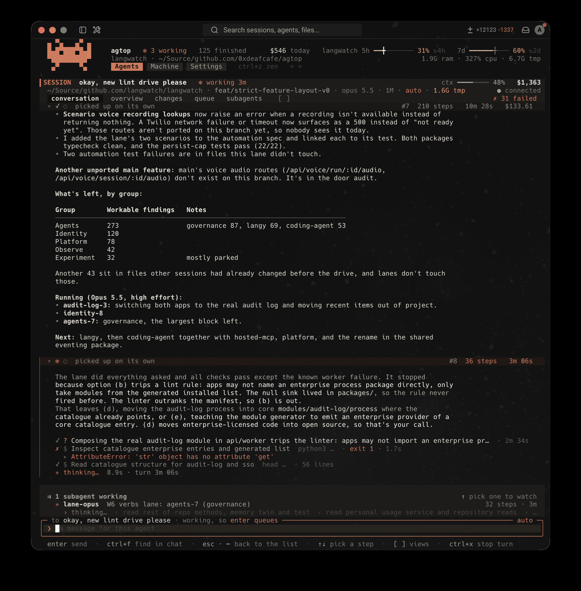
  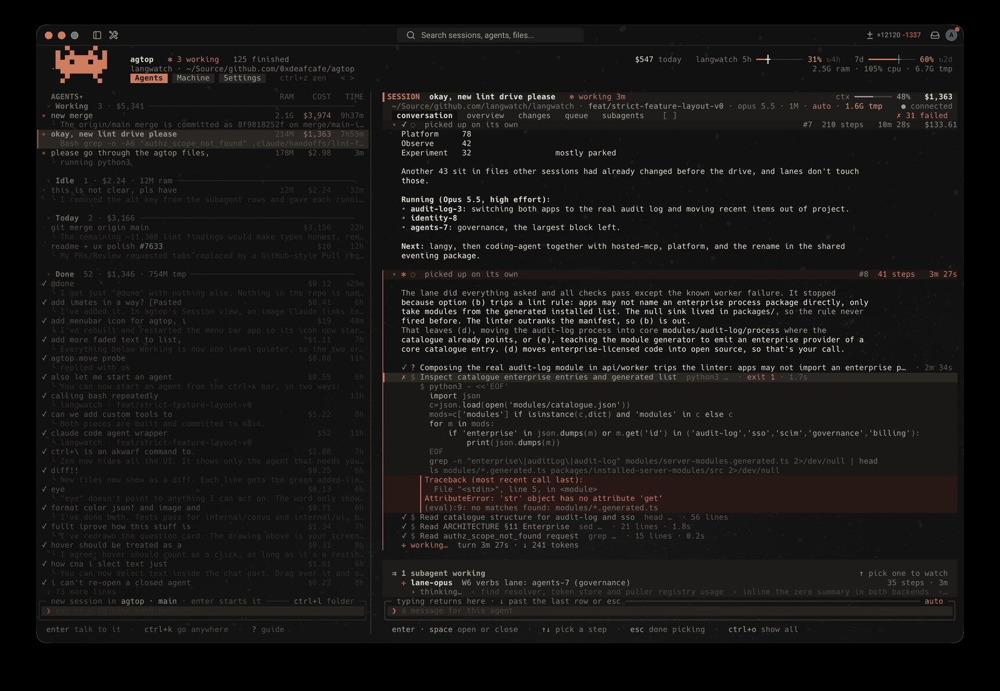
</p>
<p>
  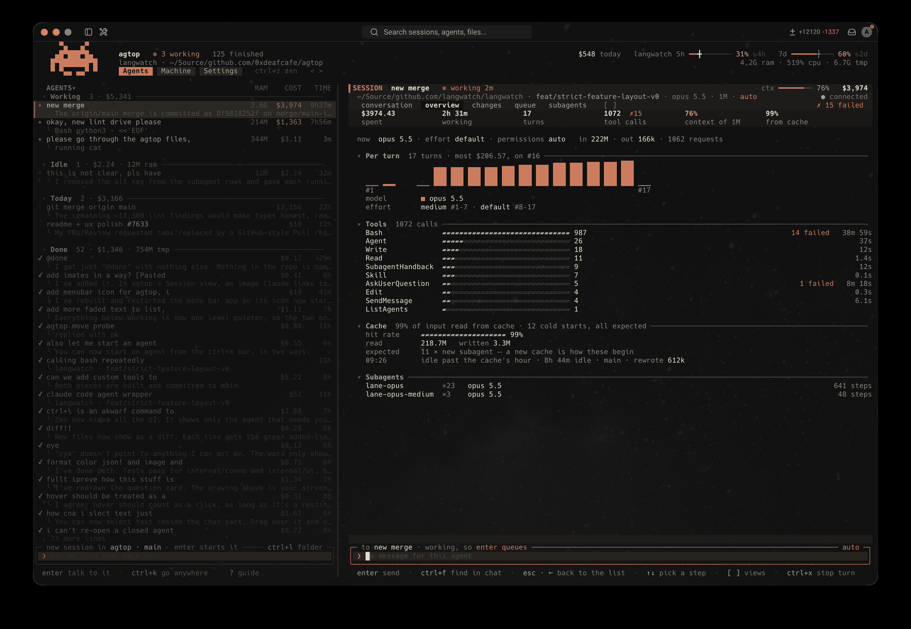
  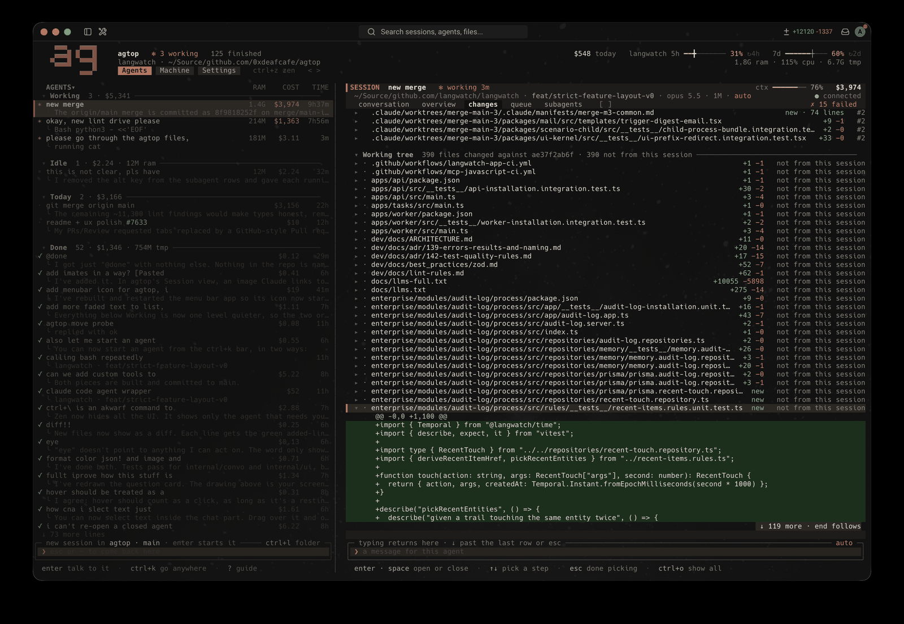
</p>
<p>
  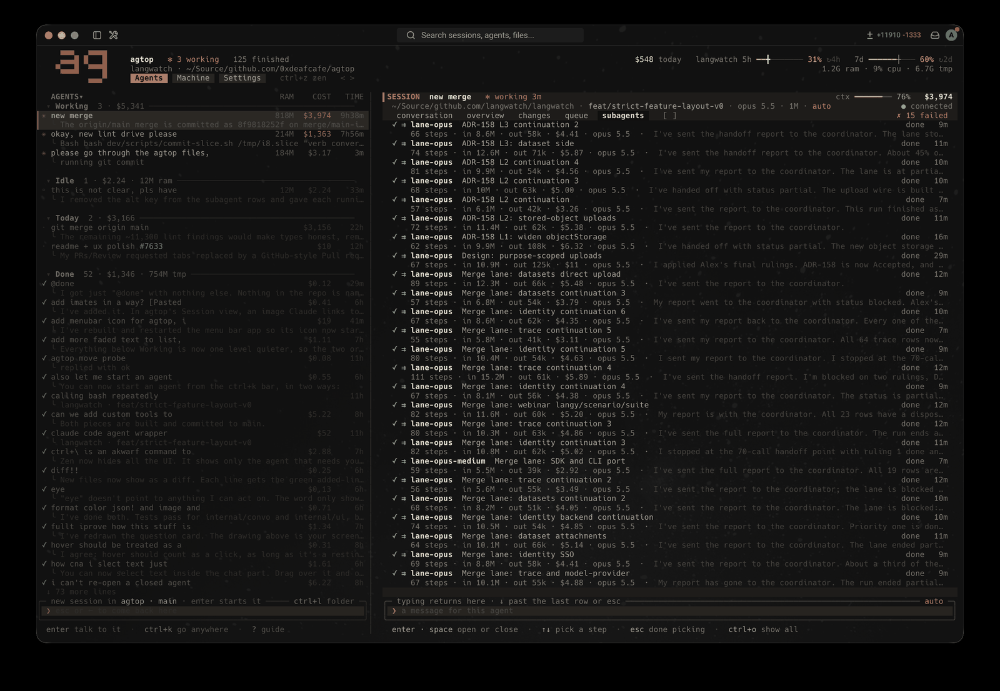
</p>

### Go anywhere

`ctrl+k` opens the command bar: go to a place or page, an agent, a Session's view, a turn (`#12`), `Back` to where you last jumped from, or start an agent with what you typed. Words search the open conversation and every agent's transcript, read in the background (`in:name`, `is:failed`, `file:x`, `turn:10-13` narrow it). `ctrl+f` is the same bar, finding where you are: that chat, then its group, then every agent.

<p>
  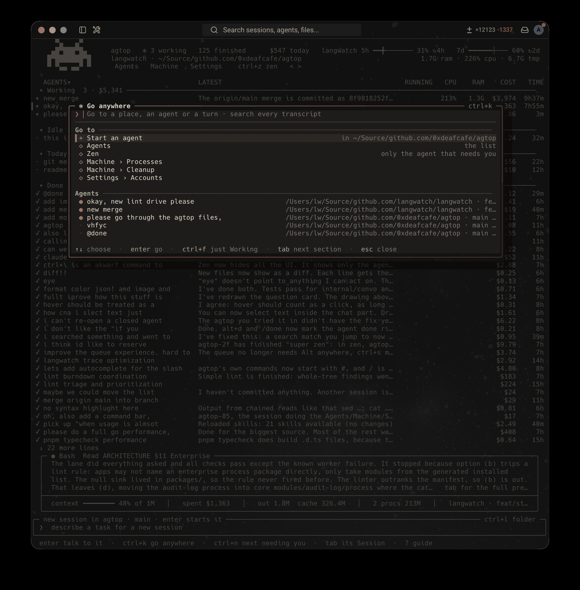
  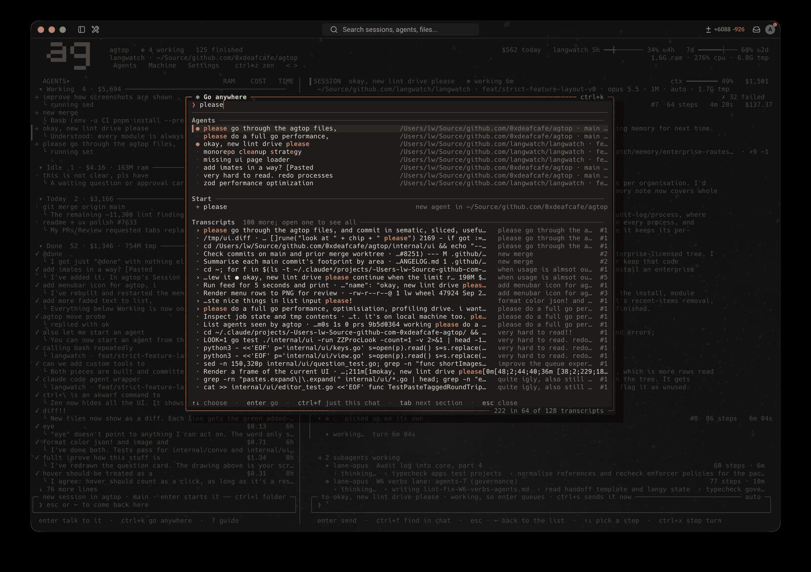
</p>

### Commands

`#` starts one of agtop's commands, on the selected agent (or, in a Session's box, that agent): `#done #stop #restart #rm #kill #clean #cd #add-dir #pin #pr #full #sort #by #account #hibernate #native #tour`. A picker offers them as you type, and a command's choices after a space. `/` is left to Claude's own commands and skills.

### Accounts

Settings › Accounts lists the Claude accounts `~/.claude` can be signed in as, with each one's 5-hour and weekly usage. Every session shares `~/.claude` (settings, transcripts, history); only the sign-in changes. `a` signs in to another account, `enter` switches to one. When the account in use reaches 95% of its 5-hour or weekly usage, or an agtop session is stopped by a limit, agtop switches to the account with the most room left: idle agtop sessions pick it up with their next message, and those the limit stopped carry on straight away. `s` keeps agtop on the account you're on. Older `~/.claude-*` folders stay listed for the sessions they hold, and their sign-ins are added as accounts.

Settings › Coding agents chooses the model, effort and permissions new sessions start with, and which of your agents they run as.

<p>
  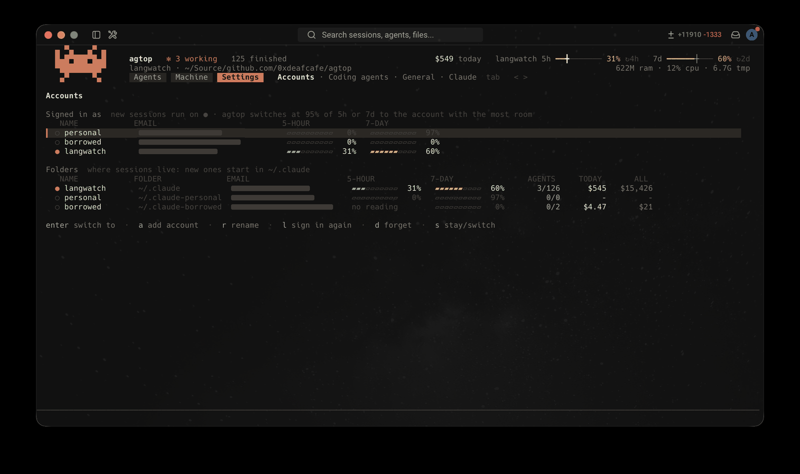
  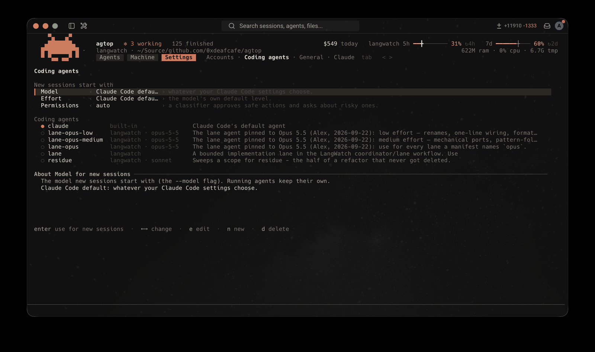
</p>

### Machine

- **Processes**: every agent's process tree, busiest first, each command shown as it was asked for. Processes a finished session left running (a dev server, a watcher) are listed first as orphans: `x` ends one, `X` all of them. What an agent leaves running is ended when it stops.
- **Cleanup**: every agent's worktree with its size and whether removing it would lose anything (uncommitted files, commits on no remote), and every agent's temp work. `x` removes one, `A` everything that loses nothing. Done work goes by itself once it's committed, pushed and left alone (Settings › Claude).

<p>
  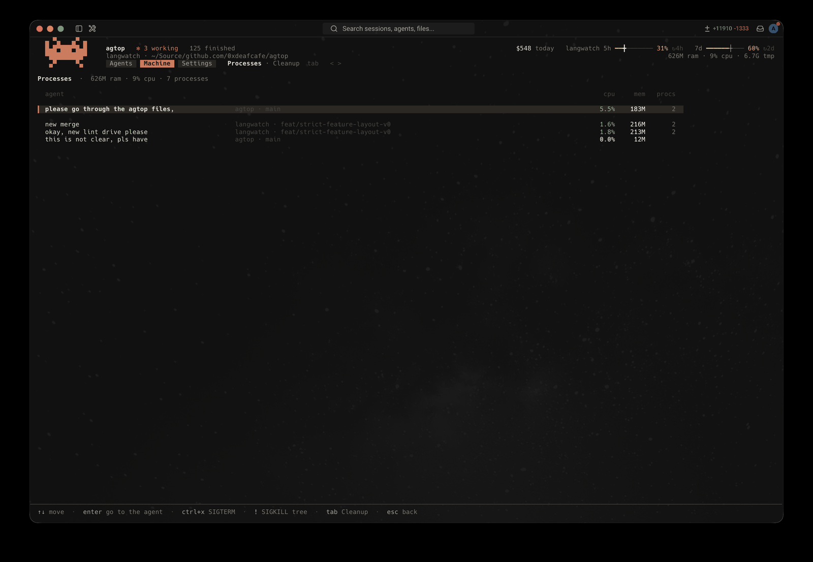
  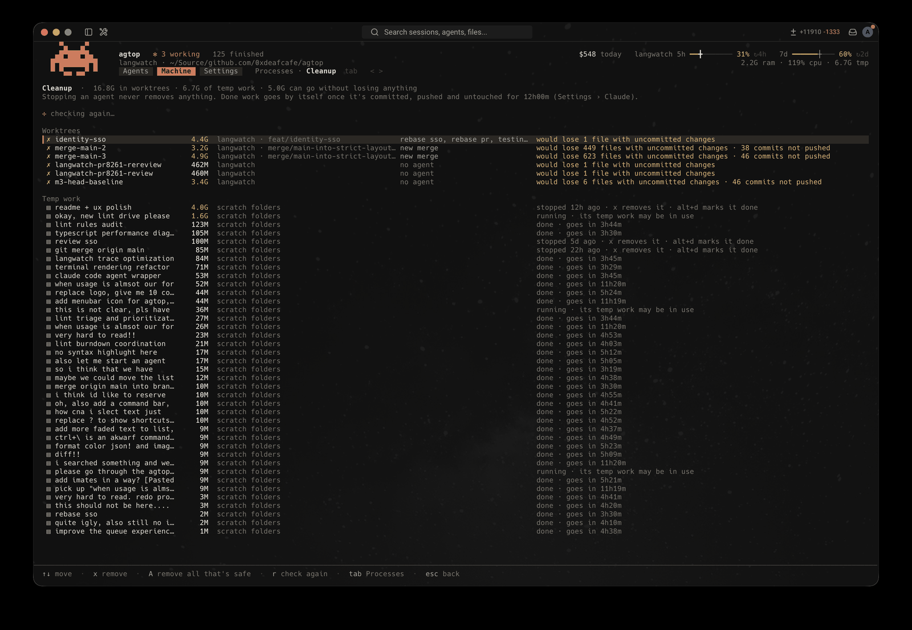
</p>

### Menu bar

The menu bar icon shows every account's 5-hour and weekly usage, the agents working and what each is doing, and a badge for each waiting on you. A new question gets a notification: an agtop session's question with a few answers can be answered from its buttons (or typed as a reply), and a permission allowed or denied; the menu does the same. It's a small Swift app built on your Mac the first time (it needs Xcode's command line tools), and Settings › General › Menu bar icon turns it on and off.

### Zen

`ctrl+z` shows only the agent that needs you and its box, no header or hints, and the next one when it's answered. `ctrl+n` skips, `ctrl+z` leaves.

### Light

It uses about 40 MB of memory with a session open (a 38-hour session with 342 subagent runs: 56 MB); the native view uses about 330 MB. When idle it does almost no work: it follows transcripts by the kernel saying they changed, and re-reads only files that did. Each agtop session's host stays small too, and hands memory back when Claude goes idle; an idle one's Claude Code rests after a few minutes and starts again with your next message. Transcripts untouched for two days are stored compressed by the file system, and read as before.

`agtop --soak 30s 200x50` runs the view headless against your agents and prints what it cost (CPU, memory, allocations, GC); `AGTOP_CPUPROFILE` and `AGTOP_MEMPROFILE` write pprof profiles from the view or a host.

## Keys

| Key | Action |
| --- | --- |
| `↑ ↓` `enter` | move, open the agent |
| type + `enter` | start a new session; with the preview open, reply to the agent |
| `ctrl+r` `ctrl+t` `ctrl+e` | rename, pin, set group |
| `ctrl+x` | stop; on a stopped agent, press twice to delete |
| `ctrl+s` | group by status → repository → account → your groups |
| `tab` | the list ⇄ the agent's Session; in Machine and Settings, their pages |
| `ctrl+k` (or `cmd+k` where the terminal passes it on) | the command bar: go to a place or page, an agent, a Session's view, a turn (`#12`), `Back` to where you jumped from, *Start an agent* (what's typed, under *Start*, becomes a new agent's task, in the folder for new sessions); words search the open conversation and every agent's transcript (`in:name`, `is:failed`, `file:x`, `turn:10-13` narrow it). In a box, `ctrl+k` still cuts to the end of the line when there's text after the cursor |
| `ctrl+f` | the same bar, finding where you are: in a Session, that chat (`#12`, `is:failed`, `file:x`); in the list, the selected agent's group and its transcripts; in Machine or Settings, that place's pages. `ctrl+f` again widens it (chat → group → all agents → everywhere), as does backspace with nothing typed; `ctrl+k` jumps to everywhere. A Claude Code agent full screen is `#full` or the bar's *Open full screen* |
| `ctrl+z` | Zen: only the agent that needs you and its box, no header or hints; the next one when it's answered. `ctrl+n` skips, `ctrl+z` leaves |
| `<` `>` (nothing typed) | previous and next place: Agents · Machine (Processes, Cleanup) · Settings (Accounts, Coding agents, General, Claude) |
| `alt+d` | Done: to Done, its idle process stops |
| `ctrl+l` | change repo |
| `#` | agtop's commands, on the selected agent (or, in a Session's box, that agent): `#done #stop #restart #rm #kill #clean #cd #add-dir #pin #pr #sort #by #account #hibernate #native` |
| `/` | Claude's commands and skills: in the list's box it starts a session with one |
| `?` | the guide |

## How it works

agtop only reads Claude Code's files: `jobs/*/state.json`, `daemon/roster.json`, `jobs/pins.json`, the transcripts, and the cached plan usage. It makes changes only through Claude Code (the daemon's control socket, with the `claude` CLI as a fallback), apart from one thing: switching account writes the other account's sign-in into Claude Code's keychain item and its `oauthAccount` into `~/.claude.json`. Each account's sign-in is kept in your login keychain as `agtop-login`, and the one in use is saved there again before every switch. Its own state (Done, names, groups, accounts, but not their sign-ins) lives in `~/.config/agtop`, and a cost cache lives in `~/Library/Caches/agtop`.

The control socket and the files are undocumented Claude Code internals, verified against v2.1.280. If a Claude Code update changes them, the affected column shows `–`, and opening an agent falls back to `claude attach`.

Plan usage is asked of Anthropic at most every five minutes per account, shared by every agtop that's open; the view says when a reading is old. Costs are estimates at list prices, not your bill.
