<h1 align="center">agtop</h1>

<p align="center">
  A replacement for the whole Claude Code interface, written in Go and built to be very fast.<br>
  It keeps what makes Claude Code great, and adds what it's missing.
</p>

<p align="center">
  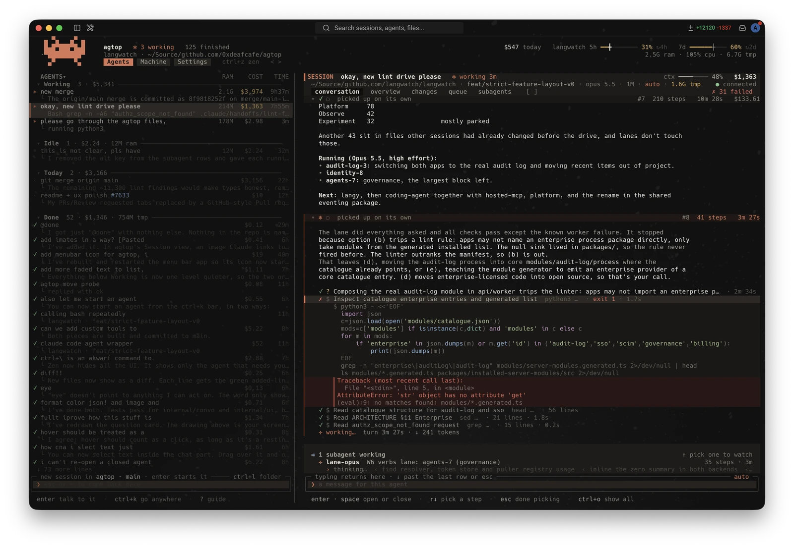
</p>

<table>
  <tr>
    <td width="50%" valign="top">
      <b>Every agent at a glance</b><br>
      What each one is doing, in words, with its cost, tokens, time, CPU and RAM.
    </td>
    <td width="50%" valign="top">
      <b>Sessions you can read</b><br>
      Highlighted code, commands in plain words, diffs, an overview, the files changed, the queue and the subagents.
    </td>
  </tr>
  <tr>
    <td valign="top">
      <b>Go anywhere</b><br>
      <code>ctrl+k</code> to a place, an agent or a turn, or search every agent's transcript.
    </td>
    <td valign="top">
      <b>Accounts that switch themselves</b><br>
      Every sign-in's 5-hour and weekly usage, and a switch to the one with the most room before a limit stops you.
    </td>
  </tr>
  <tr>
    <td valign="top">
      <b>The machine, tidied</b><br>
      Every agent's process tree, orphans ended, worktrees and temp work cleaned up safely.
    </td>
    <td valign="top">
      <b>Light</b><br>
      About 40 MB with a session open. The native view uses about 330 MB.
    </td>
  </tr>
</table>

## Install

```sh
go install github.com/0xdeafcafe/agtop/cmd/agtop@latest
```

This needs Go 1.27.1 or newer. It puts `agtop` in `$(go env GOPATH)/bin`, so make sure that folder is on your `PATH`.

```sh
agtop            # open it
agtop on         # make `claude agents` open agtop (adds one line to ~/.zshrc)
agtop off        # give `claude agents` back to Claude Code
agtop menubar    # put agtop in the macOS menu bar (`agtop menubar off` takes it out)
agtop update     # install the newest agtop
```

agtop checks for a newer version now and then and says so at the foot of the list; `#update` installs it from inside, the same as `agtop update`. Reopen agtop to use it.

Getting started sits at the foot of the list until you've tried the basics, ticking each off as you go. `#tips` brings it back, `#tips off` puts it away, and `?` is a guide to the keys.

## Agents

The list is every agent you have, with what it's doing right now: "running pnpm test", "reading view.go", "searching for PrettyModel". Working agents stand out; idle, stopped and done ones step back.

- **Cost, tokens and time** for each agent, estimated from its transcript at list prices (subagents included), and today's spend per account.
- **CPU and RAM** for everything an agent started, not just the agent itself.
- **Preview** (`tab`): the agent's own screen, live, or what it's doing, its last message and its process tree. Type to reply without opening it.
- **Open** (`enter`) connects to the running session through the daemon, like the native view. `ctrl+]` comes back.
- **Done** (`alt+d`) moves an agent out of the way and stops its process if it's idle. A message resumes it. Nothing is merged or deleted.
- **Cold cache warning**: sending to a session idle past its prompt cache's hour asks first, since it re-reads the whole context uncached.
- **Groups** (`ctrl+s`) by status, repository, account or your own (`ctrl+e`). Pins (`ctrl+t`) are shared with the native view.
- **Change repo** (`ctrl+l`) moves a conversation to another folder or worktree.

## Sessions

An agent run in agtop mode (Claude Code headless, hosted by agtop) opens in a Session beside the list. `[` and `]` move between its five views.

<table>
  <tr>
    <td width="50%" valign="top">
      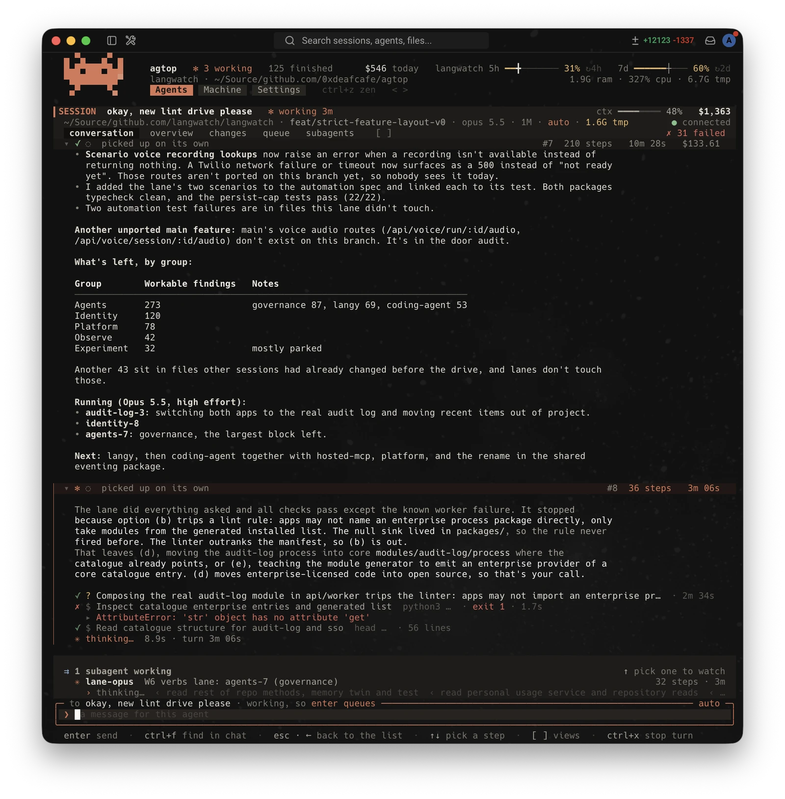<br>
      <b>Conversation</b>. Clean steps fold to one row; a failed one shows the line that says what went wrong. Shell commands say what they do, and code is highlighted.
    </td>
    <td width="50%" valign="top">
      <br>
      <b>A step, opened</b>. The script it ran and the error it hit. Drag to select and copy; <code>alt+c</code> copies Claude's answer as written.
    </td>
  </tr>
  <tr>
    <td valign="top">
      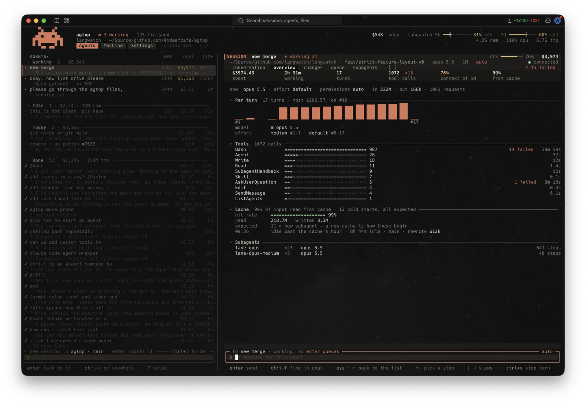<br>
      <b>Overview</b>. Spend, tokens and requests, cost per turn in each model's colour, where the model and effort changed.
    </td>
    <td valign="top">
      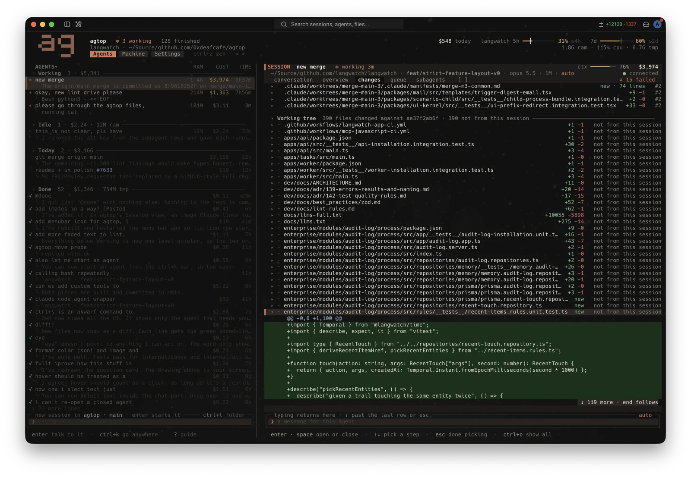<br>
      <b>Changes</b>. Every file the session changed, with its diff, and the rest of the working tree beside it.
    </td>
  </tr>
  <tr>
    <td valign="top">
      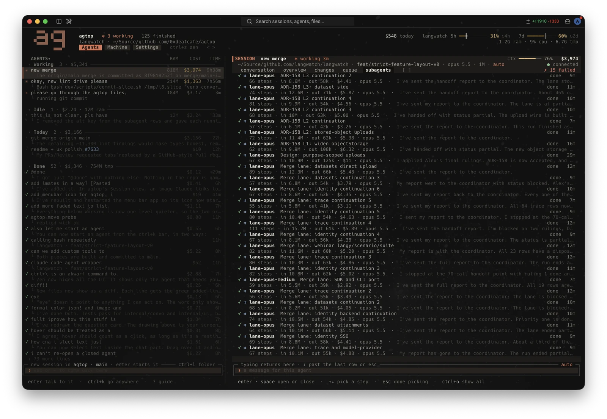<br>
      <b>Subagents</b>. Every run, with its steps, tokens, cost and last words. <code>enter</code> watches one.
    </td>
    <td valign="top">
      <b>Queue</b>. Messages sent while the agent works wait here. <code>enter</code> edits one, <code>shift+↑↓</code> merges it into the one above or below, <code>[</code> <code>]</code> move it, <code>s</code> sends it now, <code>ctrl+s</code> sends everything.<br><br>
      Claude's questions arrive as one form, with a preview beside each option. Long pastes stay a chip.
    </td>
  </tr>
</table>

## Go anywhere

`ctrl+k` opens the command bar: a place, an agent, a Session's view, a turn (`#12`), `Back` to where you jumped from, or a new agent with what you typed. Words search the open conversation and every agent's transcript, and `in:name`, `is:failed`, `file:x` and `turn:10-13` narrow it. `ctrl+f` is the same bar, starting where you are.

`#` runs agtop's own commands on the selected agent: `#done` `#stop` `#restart` `#rm` `#kill` `#clean` `#cd` `#add-dir` `#pin` `#pr` `#full` `#sort` `#by` `#account` `#hibernate` `#native` `#tips`. `/` is left to Claude.

<table>
  <tr>
    <td width="50%" valign="top">
      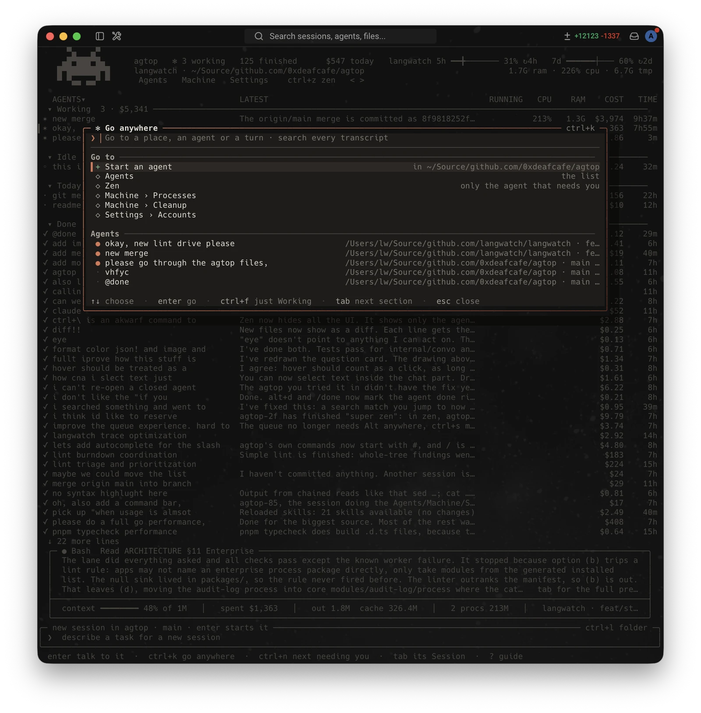<br>
      <b>The command bar</b>
    </td>
    <td width="50%" valign="top">
      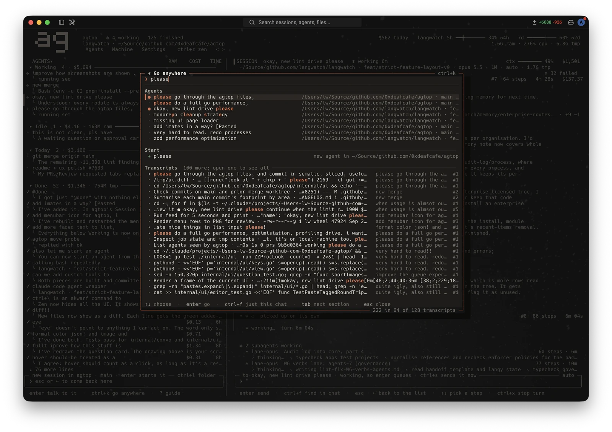<br>
      <b>Searching every transcript</b>
    </td>
  </tr>
</table>

## Accounts

Settings › Accounts lists every Claude account `~/.claude` can be signed in as, with its 5-hour and weekly usage. Only the sign-in changes; settings, transcripts and history are shared. `a` adds one, `enter` switches.

When the account in use reaches 95% of either limit, or a session is stopped by one, agtop switches to the account with the most room left. Idle sessions pick it up with their next message; stopped ones carry on straight away. `s` keeps you where you are.

Settings › Coding agents sets the model, effort and permissions new sessions start with.

<table>
  <tr>
    <td width="50%" valign="top">
      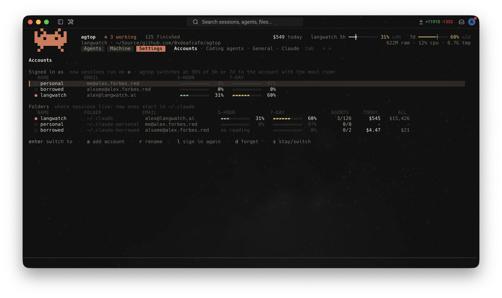<br>
      <b>Accounts</b>
    </td>
    <td width="50%" valign="top">
      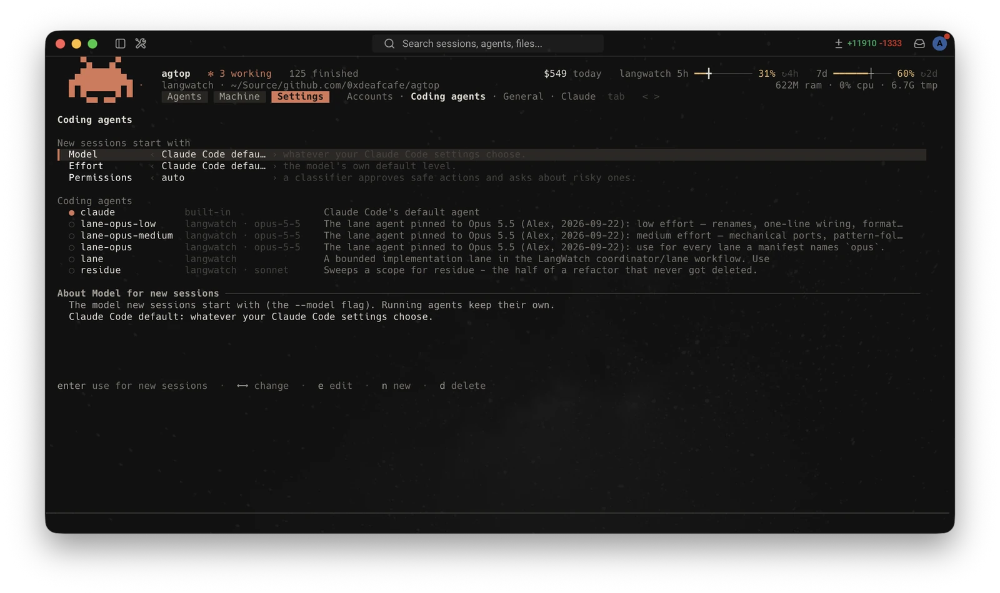<br>
      <b>Coding agents</b>
    </td>
  </tr>
</table>

## Machine

<table>
  <tr>
    <td width="50%" valign="top">
      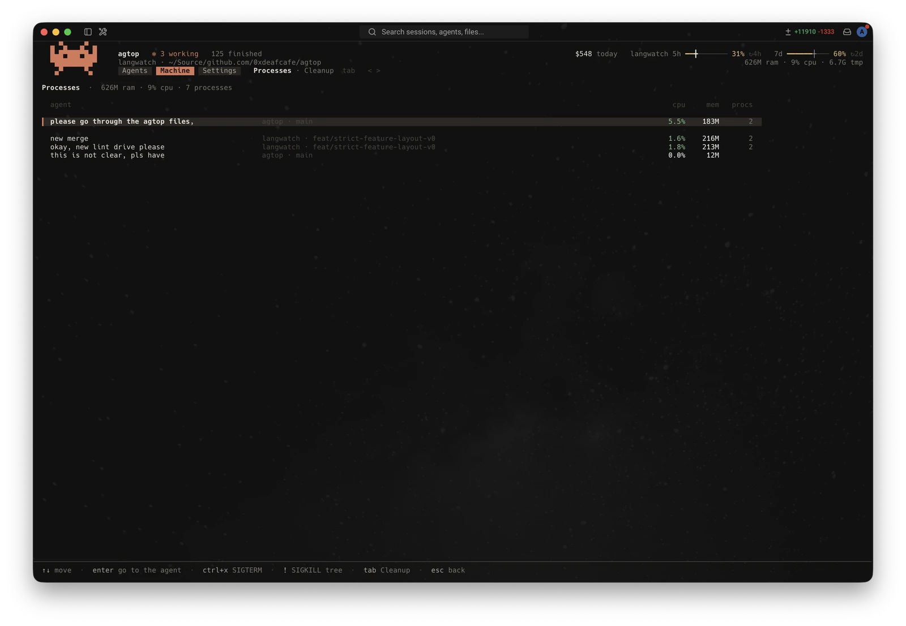<br>
      <b>Processes</b>. Every agent's process tree, busiest first. What a finished session left running (a dev server, a watcher) is listed first: <code>x</code> ends one, <code>X</code> all of them.
    </td>
    <td width="50%" valign="top">
      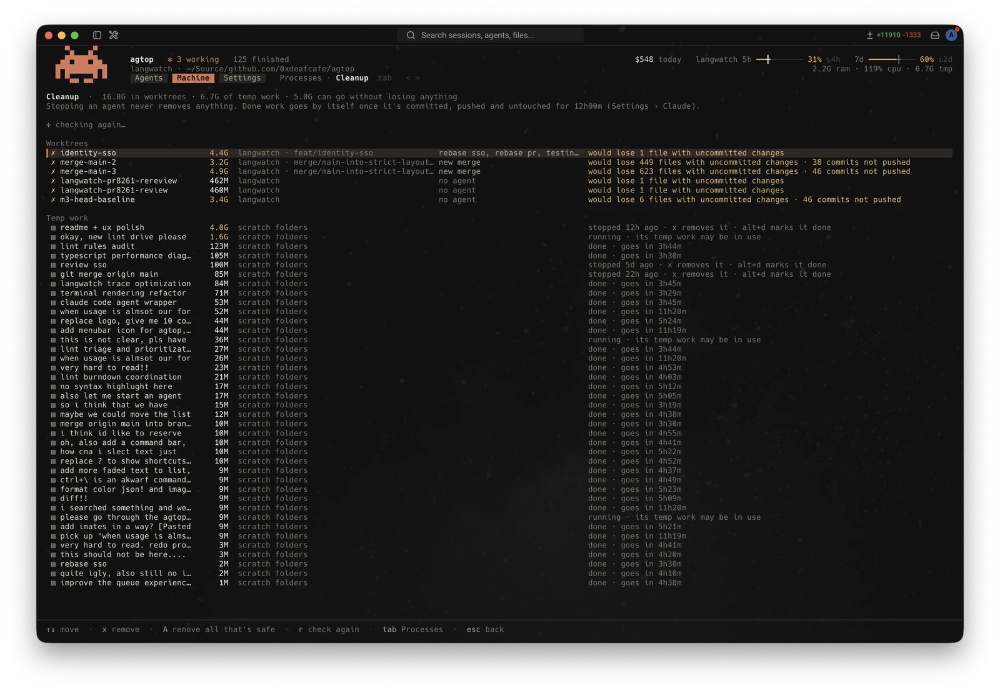<br>
      <b>Cleanup</b>. Every worktree with its size and whether removing it would lose anything, and every agent's temp work. <code>A</code> removes everything that loses nothing.
    </td>
  </tr>
</table>

## Efficiency

Where your tokens go, and whether the things that promise to cut them do. It reads every transcript (a few seconds the first time, only what's new after that) and keeps totals of the ones Claude Code deletes after 30 days.

- **Overview**. What was spent, the cache-hit rate, context per request, the context sessions start with, and where the money goes: usually context read again on every request, rarely what Claude writes.
- **Timeline**. Any figure over the last day to 90 days (context per request, cost, tokens, output, cache hits, tool output per call, context at the start), with a marker wherever a saver was set up, a setting changed, a saver was first used, or you wrote a note (`n`). `b` compares the days either side of an event and, for a saver, sessions that used it against those that didn't in the same days.
- **Savers**. rtk, caveman, context-mode, Serena, Graphify, tokensave, Context7 and Claude Code's own settings (shell output cap, compacting sooner, Sonnet for subagents). For each: what it does, what its authors claim and what others measured, whether it's on here, and how often your sessions used it. `enter` shows exactly what setting one up would run and change before anything is done; files it may touch are backed up first, and `x` removes it.
- **Findings**. What's worth doing, most dollars at stake first, each with the saver that addresses it.

`#efficiency` (or `#eff`) opens it.

## Plugins

Plugins add tools, subagents, prompt text and memory to every agtop-mode session, and can run agents of their own. Any MCP server can be one. Each runs sandboxed and does only what you approved: no files but its own, no network but the hosts it named, no programs, and only the agents it started. macOS only for now.

```sh
agtop plugin list            # what's installed, approved and running
agtop plugin approve <name>  # read what it may do, and say yes
```

To have Claude write one, install the skill: `/plugin marketplace add 0xdeafcafe/agtop`, then `/plugin install agtop-plugin-dev@agtop`.

[plugins/](plugins) has everything else: using and writing them, the examples, the skill, and how it works.

## Embedding agtop

Another app can run agtop-mode sessions without the view and show one of them in a terminal of its own.

```sh
agtop session start --cwd DIR [--session-id UUID] [--resume] [--name N] \
  [--prompt-file F] [--image PATH]... [--env K=V]... [--meta k=v]... \
  [--binary PATH] [--model M] [--effort E] [--permission-mode M] --json
echo 'the next message' | agtop session send <id> [--now] [--image PATH]...
agtop session interrupt <id>
agtop session stop <id>
agtop session info <id> --json
agtop session list --json [--meta k=v]...
```

`start` uses the model, effort, permission mode and limit settings from Settings unless a flag gives them, and prints the session's info with `"alive"` added. With `--session-id` it is idempotent: a session already running is printed, not started again. A stopped one needs `--resume`, which brings the same conversation back. `--env` values reach Claude Code on every start of it, idle restarts and resumes included. `--meta` tags the session; `list --meta` filters on the tags.

`send` reads the message from stdin. If the session is stopped it resumes with the message, as sending from the view does. `info` exits 1 with `{"error":"not found"}` for an id with no session. `alive` is whether the session's host is running; a host whose Claude Code is resting while idle counts as alive.

`agtop open <id> --solo` is the view of that one session alone, at full width: no Agents list, no header or places, and the keys that lead to other agents or places (`, . < > ctrl+\ ctrl+z ctrl+n ctrl+k tab`) do nothing. The message box has the keys from the start. `esc` at the top level and `ctrl+q` close the view; the session keeps running. A stopped session shows its conversation and resumes with the first message.

## And

- **Menu bar**: every account's usage, the agents working, and a badge for each waiting on you. Questions arrive as notifications you can answer from; clicking one brings back the terminal agtop is open in (Warp, iTerm, Ghostty…) on that agent. agtop offers it the first time it opens on a Mac. It's a small Swift app built on your Mac the first time (it needs Xcode's command line tools).
- **Zen** (`ctrl+z`): only the agent that needs you and its box, then the next one. A bar across the top says where you are in the queue; `ctrl+n` skips, holding `tab` peeks at what's working, `ctrl+z` again leaves.
- **Colour-blind palette**, in Settings › General.
- **Light**: about 40 MB with a session open, 56 MB for a 38-hour session with 342 subagent runs. Idle, it does almost nothing: the kernel says when a transcript changed, and only that file is read again. `agtop --soak 30s 200x50` measures it against your own agents.

## Keys

| Key | |
| --- | --- |
| `↑` `↓` `⌘↓` | move, open the agent (or `→`) |
| `enter` | rename it; `tab` or `↑` `↓` saves and renames the next |
| type, `enter` | start a session, or reply to the agent in the preview |
| `tab` | the list ⇄ the agent's Session |
| `ctrl+k` | go anywhere, search everything |
| `ctrl+f` | find, starting where you are |
| `,` `.` | Agents · Efficiency · Machine · Settings |
| `ctrl+r` `ctrl+t` `ctrl+e` | rename, pin, set group |
| `ctrl+s` | group by status, repository, account, your groups |
| `alt+d` | done |
| `ctrl+x` | stop; twice on a stopped agent deletes it |
| `ctrl+l` | change repo |
| `ctrl+z` | Zen |
| `#` | agtop's commands |
| `/` | Claude's commands and skills |
| `?` | the guide |

## How it works

agtop reads Claude Code's files: `jobs/*/state.json`, `daemon/roster.json`, `jobs/pins.json`, the transcripts and the cached plan usage. It changes things only through Claude Code (the daemon's control socket, or the `claude` CLI), with one exception: switching account writes the other sign-in into Claude Code's keychain item and its `oauthAccount` into `~/.claude.json`. Each sign-in is kept in your login keychain as `agtop-login`.

Its own state (Done, names, groups, accounts, not their sign-ins) lives in `~/.config/agtop`, and a cost cache in `~/Library/Caches/agtop`.

Plugins run under `agtop plugind`, sandboxed; [plugins/ARCHITECTURE.md](plugins/ARCHITECTURE.md) has how.

The control socket and the files are undocumented, checked against Claude Code v2.1.280. If an update changes them, the column affected shows `–`, and opening an agent falls back to `claude attach`.

Plan usage is asked of Anthropic at most every five minutes per account, shared by every agtop that's open. Costs are estimates at list prices, not your bill.
