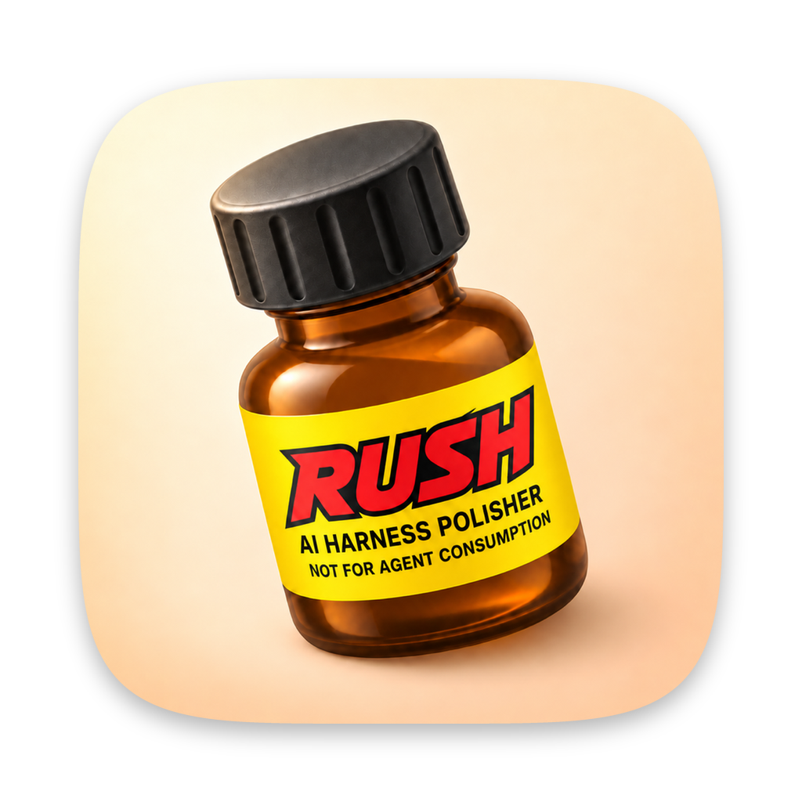

<p align="center">
  
</p>

<h1 align="center">rush</h1>

<p align="center">
  one place for every coding agent you run. written in go, about 40 mb.<br>
  started as a replacement for claude code's own view, which takes ~330 mb to show you one session.
</p>

<p align="center">
  
</p>

## install

```sh
go install github.com/0xdeafcafe/rush/cmd/rush@latest
```

needs go 1.27.1+. on apple silicon check `go env GOARCH` says `arm64`, otherwise you get an x86 build running under rosetta.

```sh
rush            # open it
rush on         # make `claude agents` open rush
rush off        # give it back
rush menubar    # limits and waiting agents in the macos menu bar
rush update     # newest version
```

`?` lists the keys. `#ask <question>` asks rush about itself, and it can change its own settings for you.

## what it does

- **the list** - every agent, what it's doing in words ("running pnpm test"), cost, tokens, cpu and ram. anything that died, hit a limit or has a question goes to the top. `alt+g` tells it to carry on.
- **sessions** - conversations you can actually read: folded steps, highlighted code, which command in a bash chain is stuck, diffs by turn, the queue, tasks, subagents.
- **overview** - what's happening across every repo right now, and what happened today.
- **efficiency** - where the tokens go, and what savers like rtk or serena would really cut. there's an opt-in haiku + opus advisor too, about $0.30 a pass.
- **machine** - process trees, dev servers left running, worktrees safe to delete.
- **zen** (`ctrl+z`) - just the next agent that needs you.
- **`ctrl+k`** - go anywhere, search every transcript.

idle claude code gets stopped a few seconds after its turn rather than sitting on 150-200 mb for five minutes. the next message starts it again in about a second, cache intact.

<table>
  <tr>
    <td width="50%"></td>
    <td width="50%"></td>
  </tr>
  <tr>
    <td></td>
    <td></td>
  </tr>
</table>

## providers

| provider | how | support |
| --- | --- | --- |
| claude code | headless, hosted by rush | full |
| codex | `codex app-server` | tested |
| copilot | copilot cli, via `gh`'s token | tested |
| gemini, kimi, opencode, vibe | agent client protocol | preview |
| deepseek | `dsh` | preview |
| glm | zcode, via `zcode-acp-server` | preview |
| ollama | claude code on ollama, tuned per model | preview |

full is what i use every day, tested has been run against the real thing, preview is built but not tried yet.

- `#with codex` starts new sessions on codex. `/handoff codex` hands the current conversation over.
- **accounts** - every sign-in for every provider, with its limits. switching moves running sessions over at their next safe point.
- **profiles** - which providers a folder runs on, in order, and what happens at a limit: wait, try another account, or hand off to the next provider.
- **ollama** runs inside a stripped-down claude code. on an m1 max with `qwen3-vl:30b` that took the prompt from 14k tokens to 4k, and the first answer from over a minute to ~7 seconds.

## plugins

tools, subagents, prompt text and memory for every session. any mcp server can be one. sandboxed to what you approved, macos only for now.

```sh
rush plugin list
rush plugin approve <name>
```

more in [plugins/](plugins).

## embedding

other apps can run sessions headless and show one in their own terminal.

```sh
rush session start --cwd DIR [--agent A] [--profile P] [--session-id UUID] --json
echo 'next message' | rush session send <id>
rush session interrupt|stop|info <id>
rush session list --json
rush open <id> --hosted
```

## how it works

rush reads claude code's files (job state, roster, transcripts) and only changes things through claude code itself, via its daemon socket or the cli. the one exception is switching accounts, which writes the sign-in into claude code's keychain item. other agents go through [adapters](internal/adapters).

the socket isn't documented. it's checked against claude code v2.1.280, and if an update breaks it the affected column shows `–` and opening an agent falls back to `claude attach`.

costs are estimates at list prices, not your bill.

## more

[docs/guide.md](docs/guide.md) has everything: every view, key, command and flag, and what's coming. it's also what `#ask` reads.
