<h1 align="center">agtop</h1>

<p align="center">
  One place for every coding agent you run, written in Go and built to be very fast.<br>
  It started as a replacement for the Claude Code interface. Now it runs Codex, Copilot and the rest the same way.
</p>

<p align="center">
  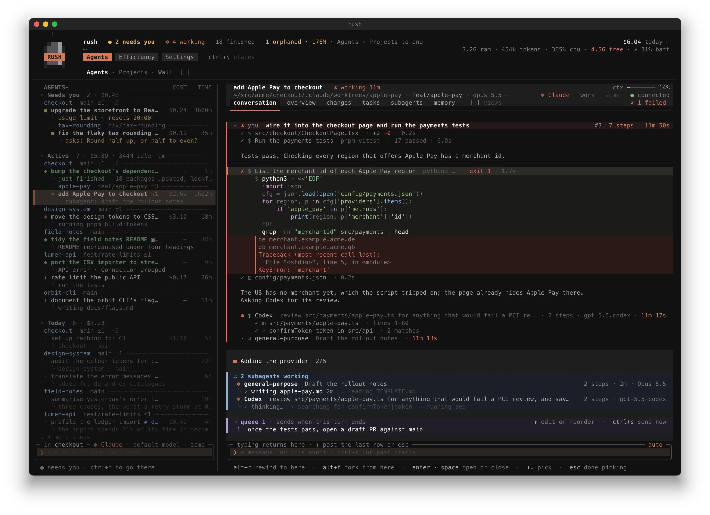
</p>

<table>
  <tr>
    <td width="50%" valign="top">
      <b>Every agent at a glance</b><br>
      What each one is doing, in words, with its cost, tokens, time, CPU and RAM. Claude Code, Codex, Copilot, Gemini, Kimi, OpenCode, Vibe, DeepSeek and GLM, in one list.
    </td>
    <td width="50%" valign="top">
      <b>Sessions you can read</b><br>
      Highlighted code, commands in plain words, diffs, an overview, the files changed, the queue and the subagents.
    </td>
  </tr>
  <tr>
    <td valign="top">
      <b>What needs you, first</b><br>
      Turns that died on an error or a limit, questions, then turns that finished. Workstreams shows it across every repo.
    </td>
    <td valign="top">
      <b>Accounts that switch themselves</b><br>
      Every account of every agent, with its limits, and a switch to the one with the most room before a limit stops you.
    </td>
  </tr>
  <tr>
    <td valign="top">
      <b>Where the tokens go</b><br>
      What you spent it on, which savers would cut it, and what each might have saved you, going by your own sessions.
    </td>
    <td valign="top">
      <b>Light</b><br>
      About 40 MB with a session open. The native view uses about 330 MB.
    </td>
  </tr>
</table>

## Install

```sh
go install github.com/0xdeafcafe/agtop/cmd/agtop@latest
```

This needs Go 1.27.1 or newer. It puts `agtop` in `$(go env GOPATH)/bin`, so make sure that folder is on your `PATH`. On Apple Silicon, check that `go env GOARCH` says `arm64`: an amd64 Go builds an x86_64 agtop that runs under Rosetta. From a checkout, `GOARCH=arm64 go build -o "$(go env GOPATH)/bin/agtop" ./cmd/agtop` builds it natively.

```sh
agtop            # open it
agtop on         # make `claude agents` open agtop (adds one line to ~/.zshrc)
agtop off        # give `claude agents` back to Claude Code
agtop menubar    # put agtop in the macOS menu bar (`agtop menubar off` takes it out)
agtop update     # install the newest agtop
```

agtop checks for a newer version now and then and says so at the foot of the list; `#update` installs it from inside, the same as `agtop update`. Reopen agtop to use it.

Getting started sits at the foot of the list until you've tried the basics, ticking each off as you go. `#tips` brings it back, `#tips off` puts it away, and `?` is a guide to the keys.

## Agents

The list is every agent you have, with what it's doing right now: "running pnpm test", "reading view.go", "searching for PrettyModel". Working agents stand out; idle, stopped and done ones step back.

- **Needs you** comes first: an agent whose turn died says why, with a ✗ ("session limit · resets 5am", "Response stalled mid-stream"), and one with a question waits there too. One that finished without asking waits in **Your turn**. `alt+g` tells either to go on.
- **Cost, tokens and time** for each agent, estimated from its transcript at list prices (subagents included), and today's spend per account.
- **CPU and RAM** for everything an agent started, not just the agent itself.
- **Preview** (`tab`): the agent's own screen, live, or what it's doing, its last message and its process tree. Type to reply without opening it.
- **Open** (`enter`) connects to the running session through the daemon, like the native view. `ctrl+]` comes back.
- **Done** (`alt+d`) moves an agent out of the way and stops its process if it's idle. A message resumes it. Nothing is merged or deleted.
- **Cold cache warning**: sending to a session idle past its prompt cache's hour asks first, since it re-reads the whole context uncached.
- **Groups** (`ctrl+s`) by status, repository, account or your own (`ctrl+e`). Pins (`ctrl+t`) are shared with the native view.
- **Change repo** (`ctrl+l`) moves a conversation to another folder or worktree.
- **Drafts**: `alt+s` keeps what you've typed and clears the box for the next thing; `alt+p` brings the latest back, and again for older ones. `#drafts` has them, with what you sent and what you cleared.

## Other agents

agtop runs any agent it has an adapter for, and shows only the ones you have installed. It finds them on your `PATH` and where their installers put them, so an agent installed while agtop is open turns up without a restart.

| Agent | How agtop runs it |
| --- | --- |
| Claude Code | headless, hosted by agtop |
| Codex | its own `codex app-server` |
| Copilot | the Copilot CLI, signed in with `gh`'s token; its coding agent's sessions on GitHub too, with their repo and PR |
| Gemini, Kimi, OpenCode, Vibe | over the Agent Client Protocol |
| DeepSeek | `dsh`, DeepSeek's own agent |
| GLM | ZCode, Z.ai's own agent, through `zcode-acp-server` |

`#with codex` (or any of them) makes new sessions start with that agent; `#with claude` goes back, and `#with` alone says which it is and what's installed. Their past sessions sit in the list beside Claude's, marked with their agent, and a message resumes one with its own agent, model and mode. A Codex running in a terminal is followed as it works, as a Claude Code one is.

The model, effort and mode in Settings are Claude Code's; another agent starts with its own. In its sessions, `/` offers only what that agent can do.

## Sessions

An agent run in agtop mode (headless, hosted by agtop) opens in a Session beside the list. `[` and `]` move between its five views.

<table>
  <tr>
    <td width="50%" valign="top">
      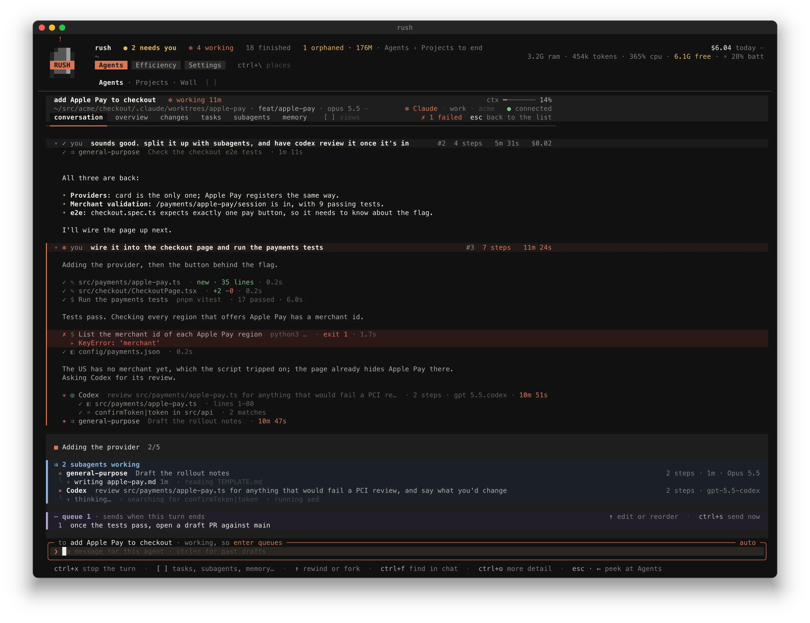<br>
      <b>Conversation</b>. Clean steps fold to one row; a failed one shows the line that says what went wrong. Shell commands say what they do, and code is highlighted.
    </td>
    <td width="50%" valign="top">
      <br>
      <b>A step, opened</b>. The script it ran and the error it hit. Drag to select and copy; <code>alt+c</code> copies Claude's answer as written.
    </td>
  </tr>
  <tr>
    <td valign="top">
      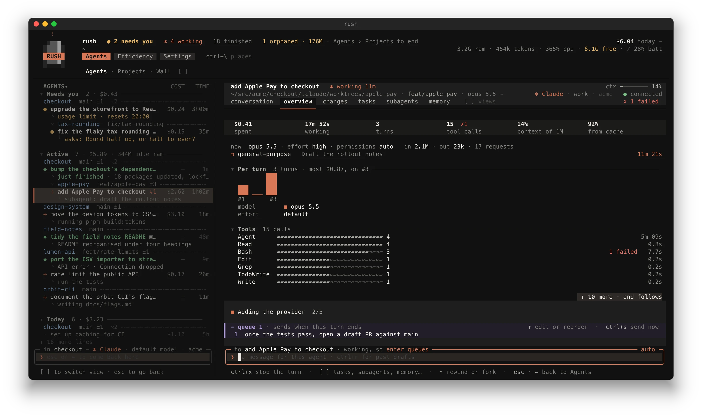<br>
      <b>Overview</b>. Spend, tokens and requests, cost per turn in each model's colour, where the model and effort changed.
    </td>
    <td valign="top">
      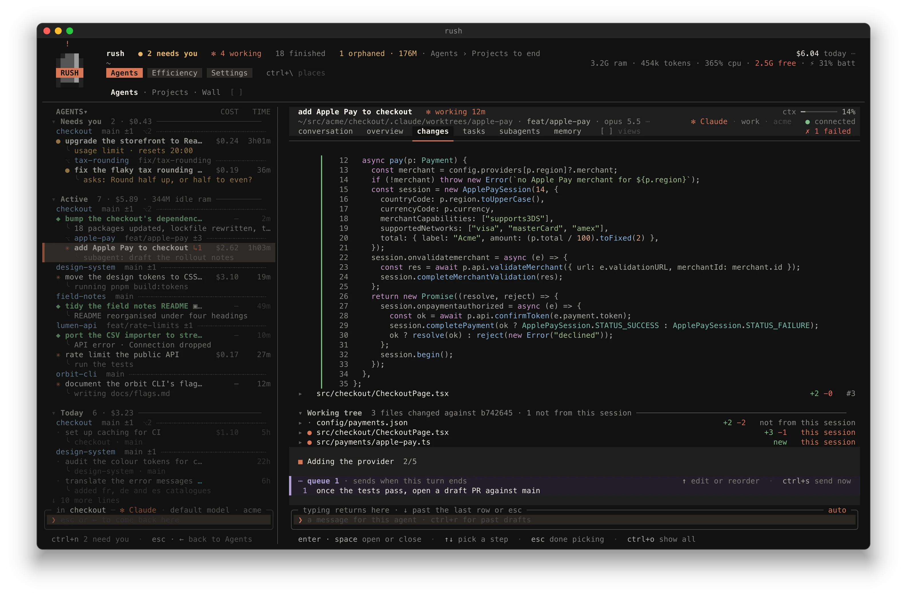<br>
      <b>Changes</b>. Every file the session changed, with its diff, and the rest of the working tree beside it.
    </td>
  </tr>
  <tr>
    <td valign="top">
      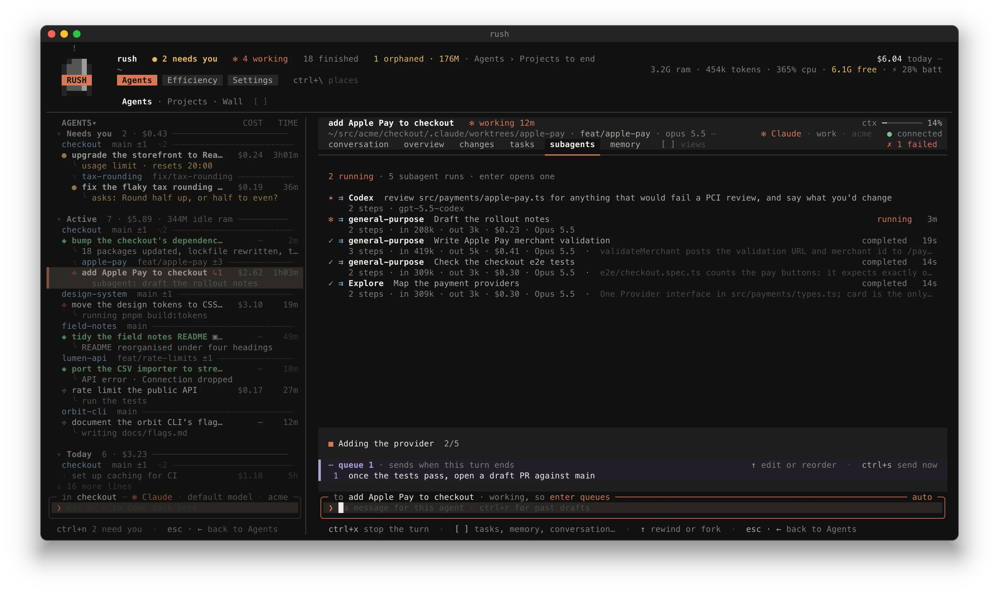<br>
      <b>Subagents</b>. Every run, with its steps, tokens, cost and last words, working for as long as it is. <code>enter</code> watches one.
    </td>
    <td valign="top">
      <b>Queue</b>. Messages sent while the agent works wait here. <code>enter</code> edits one, <code>shift+↑↓</code> merges it into the one above or below, <code>[</code> <code>]</code> move it, <code>s</code> sends it now, <code>ctrl+s</code> sends everything.<br><br>
      Claude's questions arrive as one form, with a preview beside each option. Long pastes stay a chip.
    </td>
  </tr>
</table>

Running shells, monitors and workflows sit in the dock under the conversation, each with its latest line: `↑` picks one, `b` sends it to the background, `x` stops it. A tool call to allow, a question or a usage limit opens over the conversation and takes the keys; `esc` sets it aside in the dock.

## Workstreams

The place next to Agents says what's happening across every repo. First, what's waiting on you, the most stuck first. `alt+g` tells the picked one to go on, `enter` opens it in Agents.

Below, each repo and its sessions: what each is doing, the last count it reported moving ("Lint went 11,065 → 9,052", read from its own messages), how full its context is and how often it was compacted, and its PR's checks. A repo's heading warns when two sessions work in the same checkout, and lists the heavy work running under them (installs, type checks, tests, dev servers), whose it is, how long it's run and the CPU it takes.

## Go anywhere

`ctrl+k` opens the command bar: a place, an agent, a Session's view, a turn (`#12`), `Back` to where you jumped from, or a new agent with what you typed. Words search the open conversation and every agent's transcript, and `in:name`, `is:failed`, `file:x` and `turn:10-13` narrow it. `ctrl+f` is the same bar, starting where you are. With many long transcripts, Settings › General › *ctrl+k searches transcripts* › *on ctrl+enter* keeps typing to names and commands; `ctrl+enter` then searches the transcripts (`ctrl+j` in terminals that send `ctrl+enter` as `enter`).

`#` runs agtop's own commands on the selected agent: `#done` `#go` `#stop` `#restart` `#rm` `#kill` `#clean` `#cd` `#add-dir` `#pin` `#pr` `#full` `#sort` `#by` `#with` `#account` `#drafts` `#hibernate` `#native` `#tips`. `/` is left to the agent.

<table>
  <tr>
    <td width="50%" valign="top">
      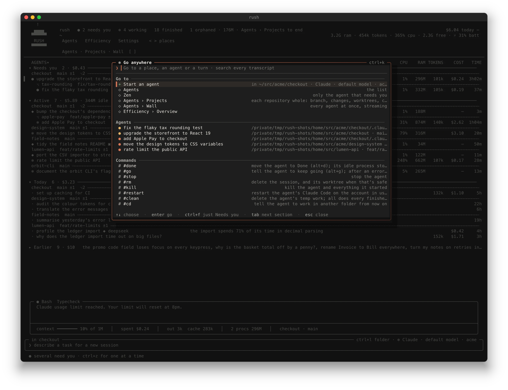<br>
      <b>The command bar</b>
    </td>
    <td width="50%" valign="top">
      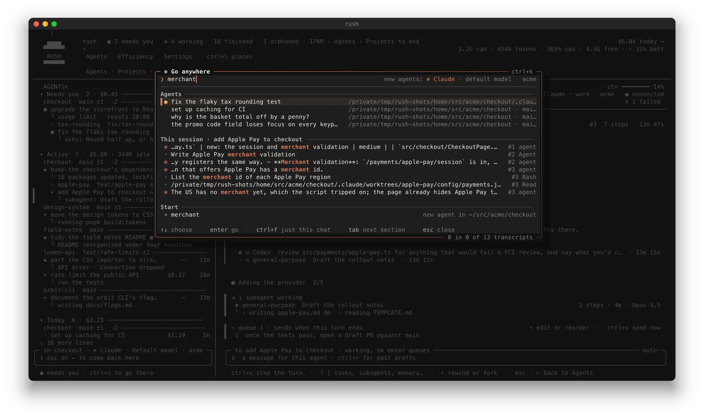<br>
      <b>Searching every transcript</b>
    </td>
  </tr>
</table>

## Accounts

Settings › Accounts lists each installed agent and, under it, the accounts it can run on: who each is, its plan, its limits, and which is in use. Every agent runs from its own home (`~/.claude`, `~/.codex`, …); an account is a sign-in swapped into it, so settings, transcripts and history are shared.

- `enter` switches to an account, or on an agent makes it the one new sessions run. `a` adds an account, `r` renames, `d` forgets.
- `J` and `K` set the order of agents; `1`–`9` jump to one.
- `s` picks what happens when an account is nearly out: switch to another account of the same agent, do that and then move new sessions on to the next agent once all its accounts are out, or stay put. Idle sessions pick up a switch with their next message; stopped ones carry on straight away, and running ones stay where they are.
- Codex keeps several sign-ins in agtop's vault and swaps one into `~/.codex`. Copilot runs on whichever of `gh`'s GitHub accounts you pick, without changing `gh`'s own. DeepSeek shows its balance; GLM its Coding Plan's limits.

The top bar shows the limits of the account new sessions start on, whichever agent that is, and the battery and free disk. Settings › Coding agents sets the model, effort and permissions new Claude sessions start with.

<table>
  <tr>
    <td width="50%" valign="top">
      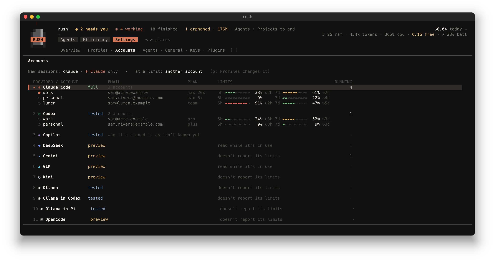<br>
      <b>Accounts</b>
    </td>
    <td width="50%" valign="top">
      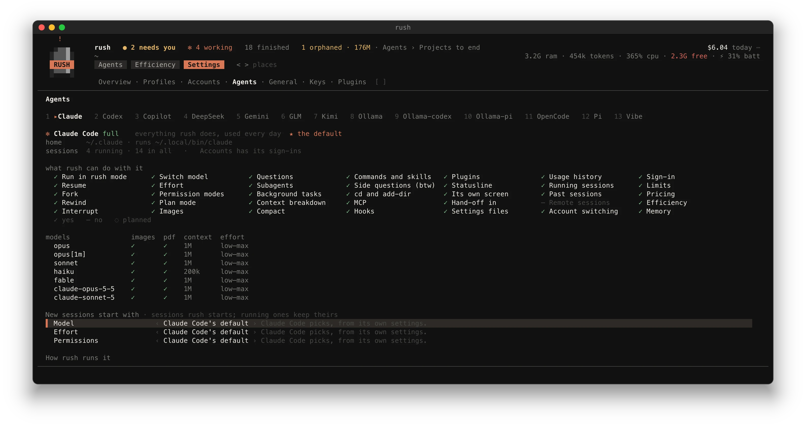<br>
      <b>Coding agents</b>
    </td>
  </tr>
</table>

## Efficiency

Where your tokens go, and whether the things that promise to cut them do. It reads every transcript (a few seconds the first time, only what's new after that) and keeps totals of the ones Claude Code deletes after 30 days.

- **Overview**. What was spent, the cache-hit rate, context per request, the context sessions start with, and where the money goes: usually context read again on every request, rarely what Claude writes. It names the savers that might save you most.
- **Timeline**. Any figure over the last day to 90 days (context per request, cost, tokens, output, cache hits, tool output per call, context at the start), with a marker wherever a saver was set up, a setting changed, a saver was first used, or you wrote a note (`n`). `b` compares the days either side of an event and, for a saver, sessions that used it against those that didn't in the same days.
- **Savers**. rtk, caveman, Ponytail, context-mode, headroom, Serena, Graphify, tokensave, codegraph, codebase-memory-mcp, claude-context, the language-server plugins, Context7, claude-mem, and Claude Code's own settings (shell output cap, compacting sooner, Sonnet for subagents, the Concise style, leaving out git instructions). For each: what it does, what its authors claim and what others measured, whether it's on here, and how often your sessions used it. `enter` shows exactly what setting one up would run and change before anything is done; files it may touch are backed up first, and `x` removes it.
- **Estimates**. What each saver might have saved you over the range: its measured cut of what your own sessions spent on the part it acts on (shell output, searching and reading code, what Claude writes, subagents on Opus…). The cut comes from independent tests where there are any, and says whose it is when there aren't; claims per question against reading every file aren't taken at their word. A saver in use is compared on sessions that used it against those that didn't, with a warning when there are too few to say much. `e` orders the Savers by estimate.
- **Findings**. What's worth doing, most dollars at stake first, each with the saver that addresses it.

`#efficiency` (or `#eff`) opens it.

## Machine

<table>
  <tr>
    <td width="50%" valign="top">
      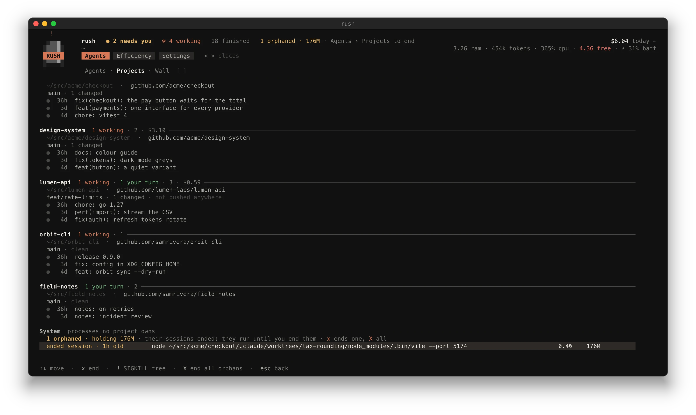<br>
      <b>Processes</b>. Every agent's process tree, busiest first. What a finished session left running (a dev server, a watcher) is listed first: <code>x</code> ends one, <code>X</code> all of them.
    </td>
    <td width="50%" valign="top">
      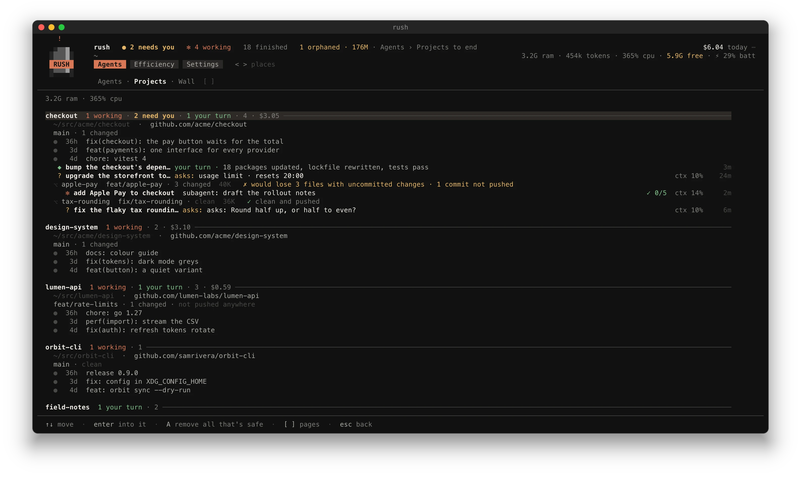<br>
      <b>Cleanup</b>. Every worktree with its size and whether removing it would lose anything, and every agent's temp work. <code>A</code> removes everything that loses nothing.
    </td>
  </tr>
</table>

## Plugins

Plugins add tools, subagents, prompt text and memory to every agtop-mode session, and can run agents of their own. Any MCP server can be one. Each runs sandboxed and does only what you approved: no files but its own, no network but the hosts it named, no programs, and only the agents it started. macOS only for now.

```sh
agtop plugin list            # what's installed, approved and running
agtop plugin approve <name>  # read what it may do, and say yes
```

To have Claude write one, install the skill: `/plugin marketplace add 0xdeafcafe/agtop`, then `/plugin install agtop-plugin-dev@agtop`.

[plugins/](plugins) has everything else: using and writing them, the examples, the skill, and how it works.

## Embedding agtop

Another app can run agtop-mode sessions without the view and show one of them in a terminal of its own.

```sh
agtop session start --cwd DIR [--agent A] [--session-id UUID] [--resume] [--name N] \
  [--prompt-file F] [--image PATH]... [--env K=V]... [--meta k=v]... \
  [--binary PATH] [--model M] [--effort E] [--permission-mode M] --json
echo 'the next message' | agtop session send <id> [--now] [--image PATH]...
agtop session interrupt <id>
agtop session stop <id>
agtop session info <id> --json
agtop session list --json [--meta k=v]...
```

`start` runs Claude Code unless `--agent` names another agtop has an adapter for (`codex`, `copilot`, `kimi`…). It uses the model, effort, permission mode and limit settings from Settings unless a flag gives them (for another agent, its own), and prints the session's info with `"alive"` added. With `--session-id` it is idempotent: a session already running is printed, not started again. A stopped one needs `--resume`, which brings the same conversation back. `--env` values reach the agent on every start of it, idle restarts and resumes included. `--meta` tags the session; `list --meta` filters on the tags.

`send` reads the message from stdin. If the session is stopped it resumes with the message, as sending from the view does. `info` exits 1 with `{"error":"not found"}` for an id with no session. `alive` is whether the session's host is running; a host whose agent is resting while idle counts as alive.

A plugin can also arrange the Agents list for an embedding app: with the `sidebar` capability it sends sections and a name for each agent, keyed by session id, and the list offers them as a group-by mode (`ctrl+s`, or `/by plugin:<name>`). The [`kanban`](plugins/examples/kanban) example shows the kanban-code board this way.

`agtop open <id> --solo` is the view of that one session alone, under agtop's header, with the Session at the terminal's whole width and no Agents list. `ctrl+\` opens Efficiency, Machine and Settings as usual, and Agents is the session again. The keys that lead to other agents or open the list (`ctrl+z ctrl+n ctrl+k tab`) do nothing, and `, . < >` are typed into the box. The message box has the keys from the start. `esc` at the top level and `ctrl+q` close the view; the session keeps running. A stopped session shows its conversation and resumes with the first message.

## And

- **Menu bar**: every account's limits, each by its own name (Codex's week reads 7d), the agents working, and a badge for each waiting on you. Questions arrive as notifications you can answer from; clicking one brings back the terminal agtop is open in (Warp, iTerm, Ghostty…) on that agent. agtop offers it the first time it opens on a Mac. It's a small Swift app built on your Mac the first time (it needs Xcode's command line tools).
- **Zen** (`ctrl+z`): only the agent that needs you and its box, then the next one. A bar across the top says where you are in the queue; `ctrl+n` skips, holding `tab` peeks at what's working, `ctrl+z` again leaves.
- **Colours** made from your terminal's own background and text, or set to dark or light, and a colour-blind palette, in Settings › General.
- **Light**: about 40 MB with a session open, 56 MB for a 38-hour session with 342 subagent runs. Idle, it does almost nothing: the kernel says when a transcript changed, and only that file is read again. `agtop --soak 30s 200x50` measures it against your own agents.

## Keys

| Key | |
| --- | --- |
| `↑` `↓` `⌘↓` | move, open the agent (or `→`) |
| `enter` | rename or open it, as you chose in Settings |
| type, `enter` | start a session, or reply to the agent in the preview |
| `tab` | the list ⇄ the agent's Session; a place's pages |
| `ctrl+k` | go anywhere, search everything |
| `ctrl+f` | find, starting where you are |
| `<` `>` · `ctrl+\` | Agents · Workstreams · Efficiency · Machine · Settings; in a Session's box `,` `.` `<` `>` are typed, so `ctrl+\` |
| `[` `]` | a Session's views, with nothing typed |
| `ctrl+r` `ctrl+t` `ctrl+e` | rename, pin, set group |
| `ctrl+s` | group by status, repository, account, your groups |
| `ctrl+n` | the next agent needing you |
| `alt+g` | tell it to go on |
| `alt+s` `alt+p` | keep a draft, bring one back |
| `alt+d` | done |
| `ctrl+x` | stop; twice on a stopped agent deletes it |
| `ctrl+l` | change repo |
| `ctrl+z` | Zen |
| `#` | agtop's commands |
| `/` | the agent's commands and skills |
| `?` | the guide |

## How it works

agtop reads Claude Code's files: `jobs/*/state.json`, `daemon/roster.json`, `jobs/pins.json`, the transcripts and the cached plan usage. It changes things only through Claude Code (the daemon's control socket, or the `claude` CLI), with one exception: switching account writes the other sign-in into Claude Code's keychain item and its `oauthAccount` into `~/.claude.json`. Each sign-in is kept in your login keychain as `agtop-login`.

Other agents run through adapters in [internal/adapters](internal/adapters): Codex over its app-server's JSON-RPC, the rest over the Agent Client Protocol. Whatever the agent, its events draw as a session. Switching a Codex account puts its sign-in in `~/.codex`, keeping the one there first so its refreshed tokens aren't lost; an API-key sign-in is named by a hash of the key, never the key. [docs/multi-agent.md](docs/multi-agent.md) has the design and where it stands.

Its own state (Done, names, groups, accounts, not their sign-ins) lives in `~/.config/agtop`, and a cost cache in `~/Library/Caches/agtop`.

Plugins run under `agtop plugind`, sandboxed; [plugins/ARCHITECTURE.md](plugins/ARCHITECTURE.md) has how.

The control socket and the files are undocumented, checked against Claude Code v2.1.280. If an update changes them, the column affected shows `–`, and opening an agent falls back to `claude attach`.

Limits are asked of each agent at most every five minutes per account, shared by every agtop that's open. Costs are estimates at list prices, not your bill.
